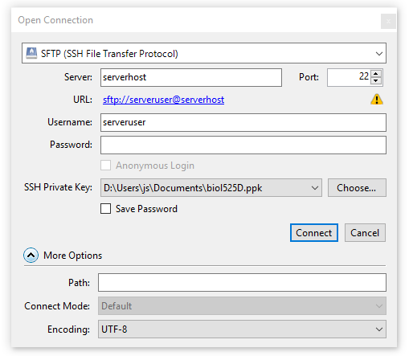
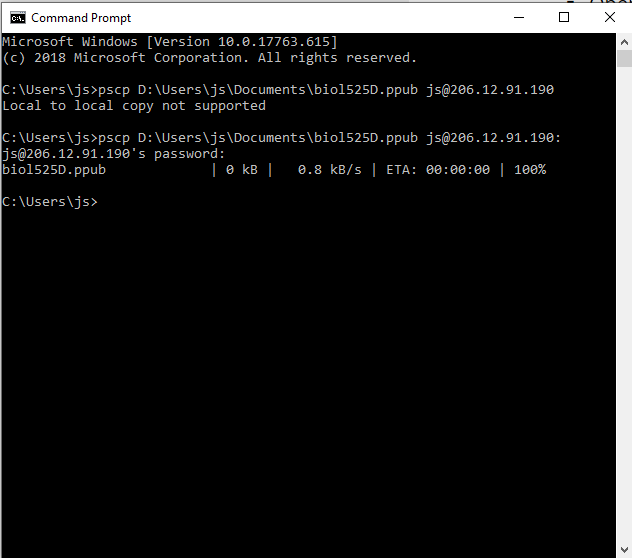
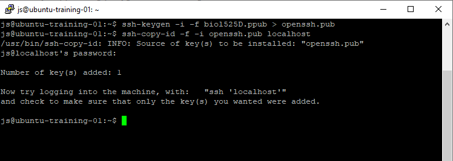

This page contains instructions to connect rapidly to your account with your private key. The exercise is part of [Topic 1](./). It assumes you've completed the steps: [generate a key](./generate_a_key) and [configure ssh-agent](./configure_ssh_agent). The result will be a working setup on your computer to run programs remotely.

> *Note: watch out for placeholders!* Replace the placeholders `serveruser`, `serverpass`, and `serverhost`, with your assigned username, password, and server address (IP).

Instructions: Read the general text, and then follow only the instructions that pertain to your operating system and software.

Time to complete: 5 minutes

### Instructions for MacOS (including Cyberduck for Mac) ###

1. Edit (or create) file `~/.ssh/config`, and add this information to it, replacing placeholders with your data, (and then save the file):

       # Allows login to your assigned server by simply doing: ssh b525
       Host b525
       HostName serverhost
       IdentityFile ~/.ssh/biol525D
       User serveruser
       ForwardAgent yes
       ForwardX11 yes

   Explanation:

     - `Host` setting is a friendly name that you choose. You will use it as a shorthand alias when connecting: i.e. `ssh b525`.
	 - `HostName` is the address of your assigned server (e.g. 123.123.123.123).
     - `IdentityFile` is the path to the private key to use (it will use that one from your agent).
	 - `User` is your username _on the server_.
	 - `ForwardAgent` allows you to connect to other servers _from that server_ while relying on the local agent. This is useful if you hop on from one server to another using one set of keys. If you configure your public key in your github accout, for instance, you would be able to issue git commands without passwords, _on the server_. If you don't trust the administrators of the server, you would choose "no".
     - `ForwardX11` allows running graphical applications installed on the server, but viewing the window _from your computer_. Again, if you don't trust the admins, set it to "no".
	 - If you wish to know more about this file, see the manual page: `man ssh_config`

1. Configuring cyberduck.

   No config needed! Once you've configured your `ssh_config` like
   described above, then you should be able to connect to your server
   using the short alias you configured, e.g. `b525` as part of the "server name". Cyberduck will
   also automatically rely on your `ssh-agent` to provide the
   necessary credentials.

1. The remaining step is to configure your account on the server to recognize the public key that is loaded in your ssh-agent's keyring. We will require access to the files of the account. Therefore, we will login _once_, using your password, and then adding the public key to a recognized filename. On subsequent logins, the key will suffice. There is a helper command that does it for you:

       ssh-copy-id -i ~/.ssh/biol525D.pub b525

   What the above command does:
      - logs in to the server as serveruser
	  - appends the given public key to ~/.ssh/authorized_keys.

   Note that the command above uses your new alias (i.e. `b525`), and the default username and server hostname are automatically
   selected from `~/.ssh/config`. It is equivalent to the full command:

       ssh-copy-id -i ~/.ssh/biol525D.pub serveruser@serverhost

	You will be asked you for your account password (not your key passphrase). Once this is configured, you won't need your password again to connect over ssh.

    > *Note:* The first time you connect to a server over ssh, it will
	>         ask you to authorize the server's public keys. The
	>         server is also using a public key to identify itself to
	>         your computer. Ideally, you know ahead of time which
	>         public key to expect.


### Instructions for Windows: MobaXTerm ###

1. Open a local terminal.

1. Edit the file `~/.ssh/config`:

   ```
   # moba's editor doesn't always open if you try to edit a file which does not exist
   # so we -touch- it first, which will create it if needed.
   touch ~/.ssh/config
   edit ~/.ssh/config
   ```

   In the editor, add the following section, making sure to replace `serverhost` and `serveruser`:

   ```
   # Allows login to your assigned server by simply doing: ssh b525
   Host b525
   HostName serverhost
   IdentityFile ~/.ssh/biol525D
   User serveruser
   ForwardAgent yes
   ForwardX11 yes
   ```

   Explanation:

     - `Host` setting is a friendly name that you choose. You will use it as a shorthand alias when connecting: i.e. `ssh b525`.
	 - `HostName` is the address of your assigned server (e.g. 123.123.123.123).
     - `IdentityFile` is the path to the private key to use (it will use that one from your agent).
	 - `User` is your username _on the server_.
	 - `ForwardAgent` allows you to connect to other servers _from that server_ while relying on the local agent. This is useful if you hop on from one server to another using one set of keys. If you configure your public key in your github accout, for instance, you would be able to issue git commands without passwords, _on the server_. If you don't trust the administrators of the server, you would choose "no".
     - `ForwardX11` allows running graphical applications installed on the server, but viewing the window _from your computer_. Again, if you don't trust the admins, set it to "no".
	 - If you wish to know more about this file, see the manual page: `man ssh_config`

1. Save the file and close the editor.

1. Run the following command (in a local terminal) to add our public key to the server account:

        # notice that we are using our new alias from ~/.ssh/config: b525
        ssh-copy-id -i ~/.ssh/biol525D.pub b525

        # (if you skipped the ~/.ssh/config part, you can simply use
		#  serveruser@serverhost (your username and IP) instead of "b525")

   You will be asked for your server password (not the key
   passphrase). The tool will copy the public key to the account's
   `~/.ssh/authorized_keys` to recognize this key as a valid way to
   authenticate.

   If this is the first time you connect to that server with Moba,
   Moba will prompt us to cache the password. I don't recommend
   relying only on saved user/passwords to login to servers. Keys are
   safer than saved passwords, and they never leave your computer even
   when you hop between proxies.

   > *Note:* You can access saved passwords in MobaXTerm in:
     `Menu` -> `Settings` -> `Configuration` -> `General Tab` -> `MobaXterm passwords management`.
	 You will not need to use a saved password to connect from now on.

   The output of `ssh-copy-id` will look like this:

   ```
   /bin/ssh-copy-id: INFO: attempting to log in with the new key(s), to filter out any that are already installed
   /bin/ssh-copy-id: INFO: 1 key(s) remain to be installed -- if you are prompted now it is to install the new keys
   myuser@myserver's password: ******

   Number of key(s) added: 1

   Now try logging into the machine, with:   "ssh 'b525'"
   and check to make sure that only the key(s) you wanted were added.
   ```

   If you type `ssh b525` like the command output suggests, you should automatically be logged in
   without typing in a password.

### Instructions for Windows: Cyberduck ###

Cyberduck works on Mac and Windows. In theory, it should pick up the
keys loaded in the Pageant program, but there are numerous reports of
the feature not working as expected on Windows.

So for cyberduck on Windows, you will have to choose either between
username/password authentication or loading the key file (.ppk)
locally in your session.

- Click "Open Connection"
- Choose SFTP as the connection type.
- In "Server" enter the server host (IP) (`serverhost`)
- In "username" enter your server assigned username (`serveruser`)
- In "SSH Private Key" browse to find your private key ppk file.
- Uncheck "Save Password"

- Here is a summary of the configuration for the connection:

  

  When you use this connection, you will be prompted for the
  passphrase to your key.  Once the keys are loaded, cyberduck will
  try to authenticate with them. If this fails (which is the case if
  you haven't yet configured the public key on your account), it will
  revert to username/password login -- this is serveruser/serverpass.

- Hit "Connect".

  It's not obvious to know you're connected sometimes, esp if there are
  0 files in your account.  But the icon in the top right will show
  "Disconnect", which means you're connected.  Once you see the file
  listing (consider that there may be 0 files listed), you can also
  toggle displaing hidden files with:

  `Menu` -> `View` -> `Show Hidden files`


### Instructions for Windows: PuTTY ###

   PuTTy can work in conjunction with Pageant to automatically
   retrieve keys, but we have to copy our public key to the remote
   account manually. The tool `ssh-copy-id` is included in certain
   toolkits (namely git for windows, and windows Bash) and is a great shortcut.
   But in this section we will show what to do when it is not available.

1. Create a new session profile in PuTTy.

   - Start putty. Shortcut: <kbd>windows</kbd>+<kbd>r</kbd>, putty+<kbd>enter</kbd>. You will see the (one and only) menu.
   - In "Session". Under "Host Name" enter your server IP: `serverhost`
   - In "Connection/Data",  under "Auto-login username" enter your server username: `serveruser`
   - In "Connection/SSH/Auth". Enable "Agent forwarding" (see notes on "ForwardAgent" in `man ssh_config`).
   - In "Connection/SSH/X11". Enable "X11 Forwarding" (see notes on "ForwardX11" in `man ssh_config`).
   - In "Window/Selection". Familiarize yourself with the mouse button actions. The default might surprise you:
     - "Left button selects (and automatically copies)"
	 - "Middle button extends existing selection"
	 - "Right button - pastes".
   - Go back to "Session". Enter a name in the field under "Saved Sessions": `b525`
   - After you've typed a name for the session, hit "Save". You will see the new entry in the list of profiles.

   > *Note:* Quirks! - If your settings need to be adjusted later on, you will have to click "b525", then "Load" the profile,
   make the change, go back to the "Sessions" tab, make sure the session you're editing is selected, and hit "Save".

1. Use the newly created PuTTy session:

   - Double click on "b525" in the sessions list.
   - Your username should be automatically filled in.
   - Type in your password

1. We're going to copy the public key over to the server.

   - Recall the location of your public key file (e.g. `biol525D.ppub`). This file was created with puTTYgen in the previous page.

   - Option 1: copy using `cmd` and `pscp`
     - Open a command terminal. <kbd>windows</kbd>+<kbd>r</kbd>, `cmd` + <kbd>enter</kbd>
     - We will copy our public key file over to the server with pscp (which comes with putty). Replace the paths and serveruser/serverhost.

           REM replace the path of the pubkey file with yours.
		   REM replace serveruser and serverhost with your assigned user/pass.
		   REM the colon at the very end is important.
		   pscp C:\Users\MyName\Documents\keys\biol525D.ppub serveruser@serverhost:

      - You should see something like this:

           {: style="width: 600px"}

		   >*Note:* The screenshot shows an error because the trailing colon is missing. Without it, pscp assumes that the parameter is
		   the destination name of a local file, rather than a username and server. The error is corrected in the second command. You can use the <kbd>UP</kbd> arrow to recall previous commands.

      - We just copied a file from our computer to the server account. Since we omitted the name of the remote file (after the colon),
	    the file keeps the local computer's file base name, i.e. `biol525D.ppub`.

    - Option 2: Copy with cyberduck

      - Open cyberduck, and connect. Navigate the file listing to your 
	    home folder (i.e. `/home/serveruser/`). This is the default when you connect. Drag the file
	    `biol525D.ppub` from your local folder, and drop it into the cyberduck file
	    listing. You might be prompted for your passphrase or server
	    password.

1. Activate the public key on the server account

   The final step is to add the public key to the special file `~/.ssh/authorized_keys` on our server account. We will connect
   to the server using username/password and use the tool
   `ssh-copy-id` installed there.

   - Log in to the server with your PuTTy session. If Pageant is
   running in the system tray, you can right-click its icon, go to "Saved Sessions"
   and pick `b525`.

   - At the server prompt (`$`), we enter two commands:
	 ```
	 # convert the key
	 ssh-keygen -i -f biol525D.ppub > openssh.pub

	 # authorize that key to login as you
	 ssh-copy-id -f -i openssh.pub localhost
	 ```


     The first command converts the .ppub public key file from putty into the openssh format (the server runs openssh tools). The second
	 command lets ssh-copy-id deal with importing the key into `~/.ssh/authorized_keys`. You will have to enter your server password.

	 > *Note:* The order of the command line arguments `-i` and `-f` is sensitive. Pay attention to the order that differs in the two commands.
	   Make sure that you are entering the command as provided. The file `biol525D.ppub` has to match the name of the file that you
	   have uploaded (via pscp or cyberduck)

   - The previous set of commands will look like this, when run:

     {: style="width: 600px"}

   - You can close the terminal, or issue the `exit` command (`e`+`x`+`i`+`t`+<kbd>enter</kbd>).

1. You're all done. Next time you start the saved putty session, (and
   your private key is loaded in the agent), you will be logged in
   automatically. This applies to all the tools in the putty suite,
   e.g. `pscp` and `psftp`.

### Next ###

You're done with this exercise. go back to [Topic 1](./)
