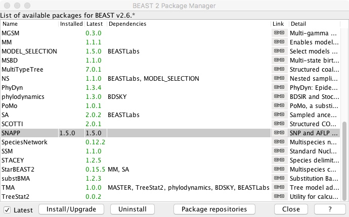
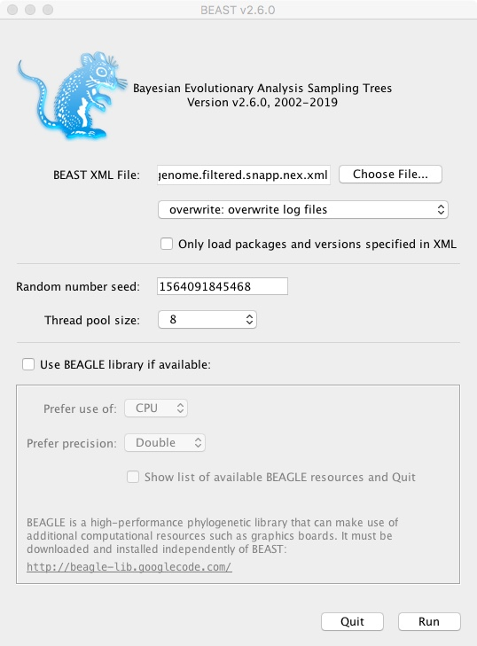
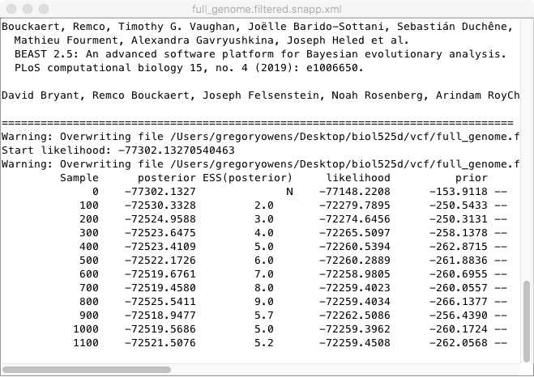
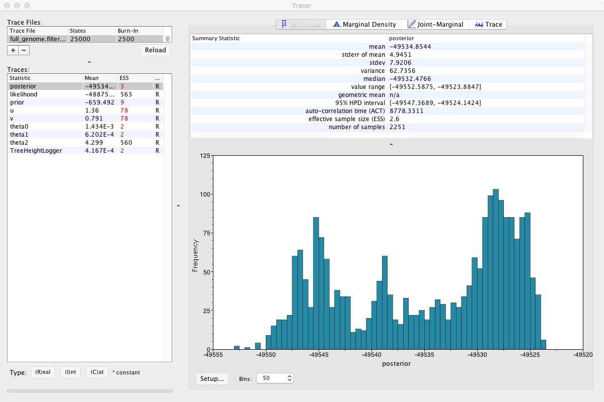
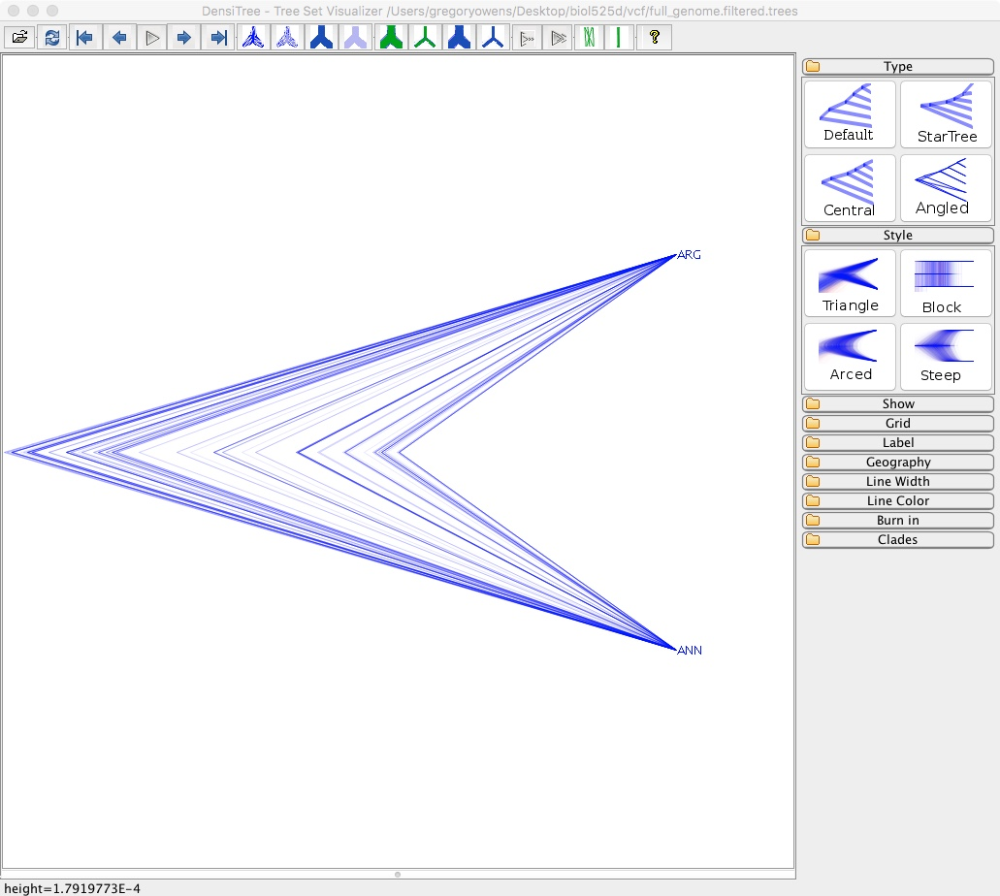

## Accompanying material
* [Slides](./Topic 10.pdf)

We're going to run our data through SNAPP since we only have variant sites. As the first step you need to download a couple things:

(BEAST2)[https://github.com/CompEvol/beast2/releases]: Choose the option that fits your operating system. _with_JRE_ means that it includes java. If you've never installed java on your computer then you should download that version.

(TRACER)[https://github.com/beast-dev/tracer/releases/tag/v1.7.1]: Again download the version that fits your operating system.

(FigTree)[https://github.com/rambaut/figtree/releases]: Choose the .dmg for mac or .zip for other systems

(vcf2nex.pl)[vcf2nex.pl]: This is a perl converter from vcf to the nexus input format. It is edited from the version on the (SNAPP FAQ)[https://www.beast2.org/snapp-faq/] to output integers instead of binary output. Put this in your biol525d project directory.

Also note, this tutorial is based heavily off this (SNAPP tutorial)[https://github.com/BEAST2-Dev/beast-docs/releases/download/v1.0/SNAPP-tutorial-2018.zip], so please refer to it for further details. 

The first step is to convert our filtered vcf into the nexus format. Nexus is a phylogenetics data format. In this case we're converting our genotypes from 0/0, 0/1 and 1/1 into 0, 1 and 2.

```bash
#Navigate to your biol525d directory in the terminal. For me its on my Desktop
cd ~/Desktop/biol525d/
perl vcf2nex.pl < vcf/full_genome.filtered.vcf > vcf/full_genome.filtered.nex
```

Next, in the BEAST 2.6.0 directory open the BEAUTi app.

* Select *File => Manage Packages*.

* Scroll down to SNAPP and click *Install/Upgrade*
* Close package window
* Select *File => Template => SNAPP*
* Select *File => Add Alignment*
* Navigate to your file full_genome.filtered.nex and select it
* Select the Species/Population column and edit the names so they're either _ANN_ or _ARG_ instead of a ANN1133, etc. 

* Select the *MCMC* tab 
* Modify *Chain Lengths* to 25000
* Modify *Store Every* to 100
* Modify tracelog => File Name to "full_genome.filtered.log"
* Modify tracelog => Log Every to 10
* Modify screenlog =? Log Every to 100
* Modify treelog => File Name to "full_genome.filtered.trees"
* Modify treelog => Log Every to 100
* Select *File => Save* and name file "full_genome.filtered.snapp"


This whole use of Beauti is setting up the SNAPP run. We're specifying which samples go to which population, since SNAPP is calculating the phylogenetic history of the population, rather than individuals. We're setting the number of MCMC chains to be very small for time limitations. Also we're not modifying the priors, which can be important and should be something you should consider for each particular dataset. 

At the end, we have a file _full_genome.filtered.snapp.xml_ that is ready for running BEAST. Onward!
* Open the BEAST app
* Select full_genome.filtered.snapp.xml as the BEAST XML File
* Select overwrite: overwrite log files
* Select thread pool size => the maximum value
* Click Run


In a terminal window beast should now be running. It's counting up to 25000, which will take a few minutes depending on your laptop speed.


Once its done, we should look at the traces. As BEAST runs, it is trying different possible tree shapes and parameters, trying to find the combination that has the highest posterior probability. We can look at those using *Tracer*

* Open Tracer v1.7.1 
* Select *File => Import Trace File*
* Navigate to your biol525d directory and find the full_genome.filtered.snapp.log file

* Click on the *Trace* tab on the right


Looking at that, we can clearly see that the MCMC chain has been climbing and may still be climbing. This means that we didn't run our MCMC long enough. If we did, it would look like a relatively flat squiggly line not trending up or down. Take a look at theta2, which seems to be relatively well estimated. A numerical representation of this is the ESS number you can see on the left. As a rule of thumb, ESS numbers should be >200.

So those scores aren't great, but lets move onto actually visualizing the trees. BEAST has recorded many different possible trees and we can visualize them using *Densitree*

* Open DensiTree (in the BEAST directory)
* Select *File => Load* and navigate to _full_genome.filtered.trees_


This isn't particularly informative since we only have two species, but you can see there is a lot of variation in node height. With more than 2 taxa you'd be able to see variation in tree topology.

Lastly, to make a more classic phylogeny, we need to take our many different trees produced by BEAST and summarize them down into a single tree with confidence estimates.

* Open TreeAnnotator (in the BEAST directory)
* Change Burnin percentage to 20 
* Change Node heights to Median heights
* Change Input Tree File to full_genome.filtered.trees
* Change Output File to full_genome_filtered.ano.tre
* Click Run


It will run and output a new .tre file. We then open that file in FigTree


* Click Node Bars and then select Display: height_95%\_HPD


This is showing the confidence interval for that node height. If we had more taxa you could also show node confidence using the branch labels feature.


The first step is to convert the VCF file into a fasta file. It is surprisingly hard to find a tool to do that, so I've supplied a script.

We only have variable sites, so we're going to use an ascertainment bias to correct for that. Typically phylogenetic programs assume you have all sites, including invariant ones.
IQtree also has a [webserver](http://iqtree.cibiv.univie.ac.at/).

When using an ascertainment bias, every site needs to be variable. Annoyingly, when many phylogenetic programs treat heterozygous site as both homozygous types with some probability. Consequently, if an allele is only represented in its heterozygous state, there is some probability that the site is invariant, causing the program to crash. The script I provide filters out those sites.

```

cd ~
zcat biol525d.snps.vcf.gz | \
     perl /home/biol525d/bin/vcf2fasta_gaps.pl \
     > biol525d.snps.fasta

# Next we run it
iqtree -s biol525d.snps.fasta -st DNA -m TEST+ASC -nt 1

# This produces several output files, including a log and a couple different versions
# of the treefile. The -m TEST command does a model test and selects
# the best substition model.
```
In the next step, we're going to use R to visualize our tree using ggtree. To do that you need to download "Biol525D.snps.fasta.treefile" to your laptop. Another way to visualize a tree is [Figtree](http://tree.bio.ed.ac.uk/software/figtree/).


```r
#First we install some packages
source("http://bioconductor.org/biocLite.R")
biocLite("ggtree")
install.packages("phytools")
```

```r
#Then load some libraries
library(ggtree)
library(phytools)
library(phangorn)
```


```r
#Then load in our data
filename <- "Downloads/biol525d.snps.fasta.treefile"
tree <- read.tree(filename)

#Lets take a look
ggtree(tree, layout="unrooted") +
  #This labels nodes by their number, so we can work with them.
  geom_text2(aes(subset=!isTip, label=node)) + 
  #This labels tips.
  geom_tiplab() 
```


```r
# The samples are very clumpy because of the lack of variation. We don't have
# an outgroup species, so lets tree a midpoint root.

tree.midpoint <- midpoint(tree)
ggtree(tree.midpoint) +
  geom_tiplab() 
```


```r
# How about we now label each population. I'm picking the node numbers
# off my phylogeny, and it may be different for your tree.
ggtree(tree.midpoint) +
  geom_text2(aes(subset=!isTip, label=node)) + 
  geom_tiplab() +
  geom_cladelabel(node=111, label="Population 2", align=T, offset=.0001) +
  geom_cladelabel(node=199, label="Population 1", align=T, offset=.0001)

```


```r
#Uh oh, labels are off the printed screen. Here's a work around
ggtree(tree.midpoint) +
  geom_text2(aes(subset=!isTip, label=node)) + 
  geom_tiplab() +
  geom_cladelabel(node=111, label="Population 2", align=T, offset=.01) +
  geom_cladelabel(node=199, label="Population 1", align=T, offset=.01) +
  geom_cladelabel(node=111, label="", align=T, offset=.03,color="white")

```


```r
#We can  make up our labels
ggtree(tree.midpoint) +
  geom_tiplab() +
  geom_label2(aes(subset=(node==111), label='Robot Fish')) +
  geom_label2(aes(subset=(node==199), label='Robots')) +
  geom_cladelabel(node=111, label="", align=T, offset=.0001,color="white") + 
  geom_cladelabel(node=199, label="", align=T, offset=-.0002,color="white")

```


### Coding challenge 1

Rename samples 050 and 051 to "turbo50" and "awesome51".

## Splitstree
Now we want to try out splitstree, a reticulate network phylogeny. Download it [here](http://ab.inf.uni-tuebingen.de/data/software/splitstree4/download/welcome.html). 
It should just run if you have the correct version of java. For newer macs you may have to install an older version of java, it should be a suggestion when you attempt to run the program.
Before we download the fasta file we have to replace all N with ?, because splitstree does not accept N.
```bash
cat biol525d.snps.fasta | sed s/N/?/g biol525d.snps.fasta > biol525d.snps.splitstree.fasta
```
Then transfer it to your laptop. Open Splitstree and select the biol525d.snps.splitstree.fasta file.
The first tree you see is a NeighbourNet, but you can also select many other algorithms or distance methods.


## Daily Questions:
1. What are two biological scenarios where you would want to use a reticulate tree, versus the standard non-reticulate tree, to represent the phylogeny?
2. What does it mean when something has 50% bootstrap support? What are two possible reasons that a node may have low support? Include one biological and one methodological reason.


