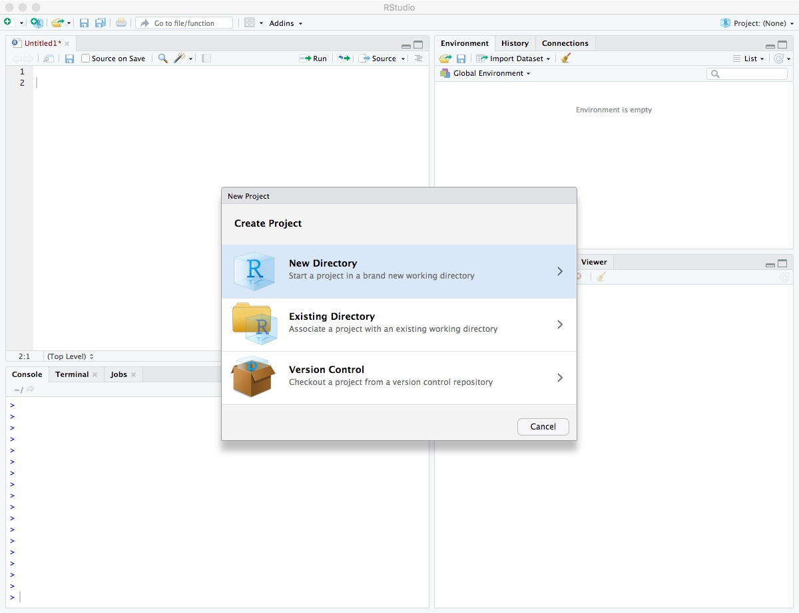
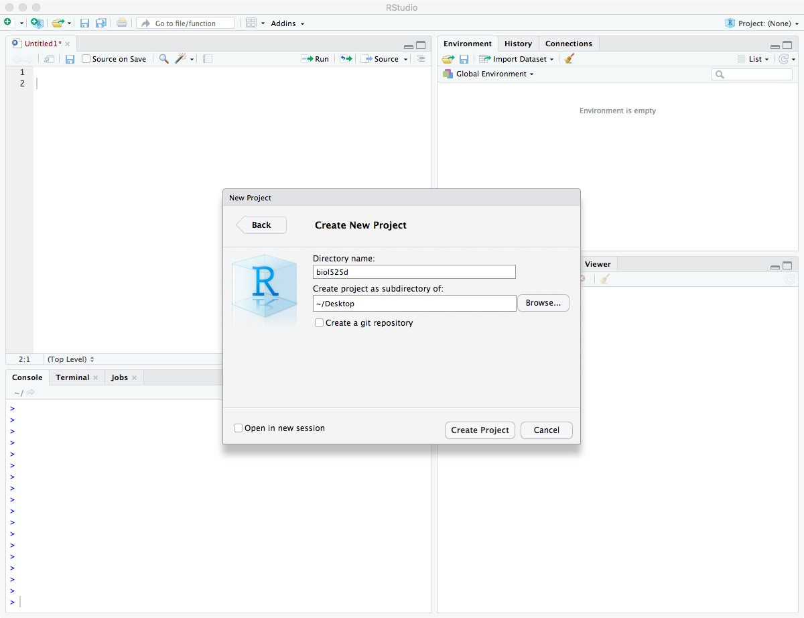

We're working with Rstudio on our desktops, so download the "vcf" and "analysis" directories to your laptop. The rest of this tutorial should be run in your Rstudio IDE. 

NOTE: This tutorial is based on Rstudio 1.2.1335 and R 3.6.1, the latest version of both. Almost all steps should work identically on older versions, but there may be issues installing some packages. In this case, I recommend updating your version of R unless you have a specific reason not to. 


The first step to any organized R project is to create a new Rstudio project. A project keeps all your different scripts and results together in a single directory. It also separates saved variables, so when you are switching between different projects you aren't accidentally using the same variables between them. 

In Rstudio, select File->New Project



Then select "New Directory".


Click on "New Directory".



Enter directory name "biol525d" and put it somewhere you can get to. In my case, I put it on the Desktop directory.


You're now in your Rstudio Project and the next step is to install the tidyverse package, which includes a suite of tools for manipulating data and plotting. The examples today will be focused on tidyverse solutions to problems. 


``` r
install.packages("tidyverse") 
library(tidyverse)
```


``` r
#I put the analysis and vcf directory in my desktop, so I've
data_directory <- "Desktop/"
sampleinfo <- read_tsv("Downloads/biol525d.popinfo.txt")
#data name and directory
name <- "Downloads/faststructure/biol525d"
#We're going to loop through each k value, so we need a dataframe to save those values
data.full <- data.frame(name=character(),
                        population=character(),
                        lat=numeric(),
                        long=numeric(),
                        variable=character(),
                        value=numeric(),
                        k=numeric())
#Now we loop through each K output
for (k in 1:4){
  #Load the data file
  data <- read.table(paste(name, k, "meanQ",sep="."),colClasses="numeric")
  #Label the columns (one for each group)
  Qnames <-paste("Q",seq(1:k),sep = "")
  colnames(data) <- Qnames
  #Add sample info to Q values
  data.info <- cbind(data, sampleinfo)
  #Melt the data into long format
  data.melt <- melt(data.info, id.var=c("name","population","lat","long"))
  #We have to make sure to include the K value for each file
  data.melt$k <- k
  #Now rbind it to the data frame outside the loop
  data.full <- rbind(data.full, data.melt)
}
#Lets try plotting for k=2
data.full %>% filter(k == 2) %>% #This selects only the k=2 lines out of the full set
  ggplot(.,aes(x=name,y=value,fill=factor(variable))) +
  geom_bar(stat = "identity",position="stack")
```


``` r
#From this, we can easily scale up to all k values using facet
data.full %>%
  ggplot(.,aes(x=name,y=value,fill=factor(variable))) +
  geom_bar(stat = "identity",position="stack") +
  facet_wrap(~k, nrow=2)
```


``` r
#How about if we want to order samples by the reverse of latitude.
data.full %>%
  mutate(name = factor(name, levels = name[order(-lat)])) %>%
  ggplot(.,aes(x=name,y=value,fill=factor(variable))) +
  geom_bar(stat = "identity",position="stack") +
  facet_wrap(~k, nrow=2)
```


``` r
#The order works, but lets try to make it look nicer

data.full %>%
  mutate(name = factor(name, levels = name[order(-lat)])) %>%
  ggplot(.,aes(x=name,y=value,fill=factor(variable))) +
  geom_bar(stat = "identity",position="stack") +
  facet_wrap(~k, nrow=5) +
  theme_classic()+
  theme(axis.text.x = element_blank(),
        axis.ticks = element_blank(), 
        axis.line = element_blank(),
        axis.title.x = element_blank(),
        axis.title.y = element_text(size=16),
        strip.background = element_blank()) +
  ylab("q-value")+
  guides(fill = guide_legend(title = "Group", title.position = "left"))
```


Plotting challenge 1
--------------------

-   For K = 2, plot the faststructure results and divide your samples by populations. Furthermore, make group 1 red and group 2 blue. Title the plot "*Helianthus* is great!"


Now lets move onto [Principal Component Analysis](./pca.md)
